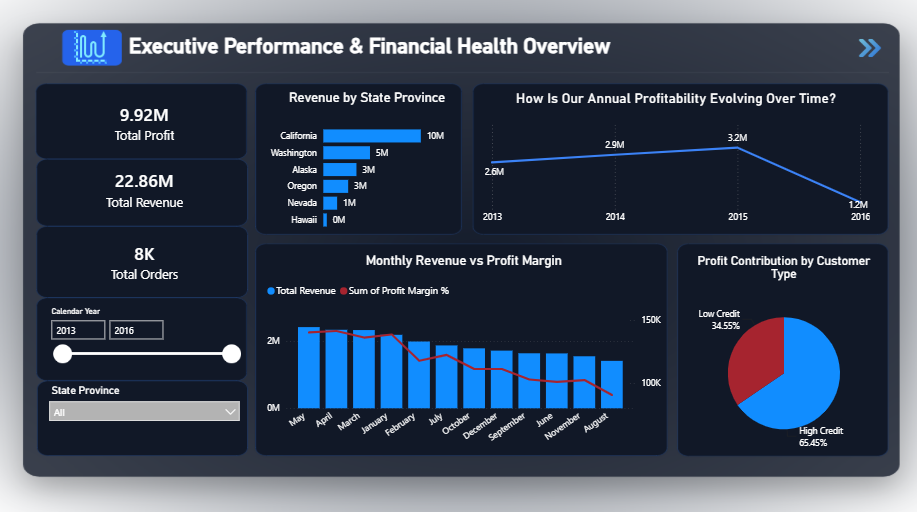
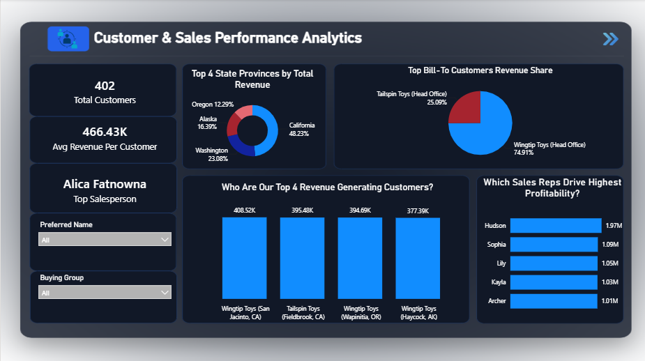

# Sales-Performance-Analytics-Hub 📊

## Overview
This project is an end-to-end data analytics and business intelligence solution developed during the midterm phase of the **Digital Egypt Pioneers Initiative (DEPI)** and **Orange Digital Center** programs. The primary goal is to analyze sales performance, track core financial metrics, and transform raw data into a strategic multi-page interactive dashboard.

## Tech Stack 🛠️
* **Data Processing & Cleaning:** Python (Pandas, NumPy, Matplotlib, Seaborn).
* **Business Intelligence & Visualization:** Power BI (DAX, Star Schema Data Modeling, Interactive UI/UX Design).

---

## Dashboard Preview 🖥️

### 1. Home Page
The central navigation hub connecting all analytical sections of the report.

### 2. Executive Performance & Financial Health Overview
Tracks core financial metrics, revenue trends over time, regional distribution, and monthly profit margins.

### 3. Customer & Sales Performance Analytics
Monitors top-tier client behavior, segment performance, revenue concentration, and individual sales representative achievements.

### 4. Product & Stock Analytics
Analyzes inventory stock levels, category profitability, color performance, and geographic distribution across US states.

### 5. Insights & Recommendations
Summarizes key findings, geographic revenue concentration, profit volatility, and strategic business recommendations.

---

## Key Features & Workflow 🚀
* **End-to-End Pipeline:** From raw data cleaning, outlier detection, and anomaly handling using Python to relational data modeling and visualization in Power BI.
* **Strategic KPIs:** Developed advanced DAX measures to track Total Revenue, Total Profit, Profit Margins, and Top Sales Representatives.
* **Interactive UI/UX:** Designed with custom layout structures to deliver seamless navigation and clear corporate insights.

## Project Structure
* `/Clean_Data`: Contains the processed datasets ready for analysis.
* `/Project_Python`: Contains Python scripts and notebooks used for data preprocessing and exploration.
* `/Row_Data`: Contains the initial raw datasets.
* `Project_Power BI.pbix`: The complete Power BI dashboard file.
